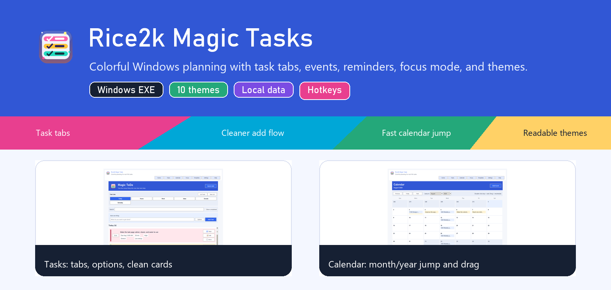

# Rice2k Magic Tasks

<p align="center">
  
</p>

<p align="center">
  A colorful Windows task planner that turns messy to-dos into smaller, calmer next actions.
</p>

<p align="center">
  
  
  
  
  
</p>

<p align="center">
  <a href="https://github.com/rice2k/rice2k-magic-tasks/releases/download/v3.2.0/Rice2k-Magic-Tasks-v3.2.0.exe"><strong>Download Windows EXE</strong></a>
  |
  <a href="https://github.com/rice2k/rice2k-magic-tasks/releases/tag/v3.2.0">Latest Release</a>
  |
  <a href="docs/USAGE.md">How To Use</a>
  |
  <a href="docs/HOTKEYS.md">Hotkeys</a>
</p>

## What It Does

Rice2k Magic Tasks is built for real-life task chaos: half-written errands, vague chores, work tasks that are secretly projects, and calendars that need quick rescheduling.

| Area | What You Get |
| --- | --- |
| Tasks | Task-list tabs, large clickable cards, subtasks, search, completion, notes, categories, priorities, and estimates. |
| Planning | Local smart rewriting, smaller steps, "start here" notes, small wins, stuck help, and helpful questions. |
| Calendar | Month view, events, recurring events, task due dates, drag-and-drop rescheduling, and fast month/year jumping. |
| Focus | One-task focus mode, 5/15/25 minute timers, next-task flow, and distraction capture. |
| Themes | Ten colorful themes plus text-size and reading-comfort settings. |
| Windows | Single-file EXE, tray menu, reminders while running, local storage, backup/export tools. |

## Screenshots

<table>
  <tr>
    <td width="50%"><strong>Tasks</strong><br></td>
    <td width="50%"><strong>Calendar</strong><br></td>
  </tr>
  <tr>
    <td width="50%"><strong>Dashboard</strong><br></td>
    <td width="50%"><strong>Settings and Themes</strong><br></td>
  </tr>
</table>

## Download

Windows may show a SmartScreen warning because the app is unsigned.

| File | Use |
| --- | --- |
| [Rice2k-Magic-Tasks-v3.2.0.exe](https://github.com/rice2k/rice2k-magic-tasks/releases/download/v3.2.0/Rice2k-Magic-Tasks-v3.2.0.exe) | Single-file Windows app. |
| [Rice2k-Magic-Tasks-v3.2.0.zip](https://github.com/rice2k/rice2k-magic-tasks/releases/download/v3.2.0/Rice2k-Magic-Tasks-v3.2.0.zip) | Release package with EXE, README, notes, and screenshots. |
| [Rice2k-Magic-Tasks-v3.2.0.sha256](https://github.com/rice2k/rice2k-magic-tasks/releases/download/v3.2.0/Rice2k-Magic-Tasks-v3.2.0.sha256) | Checksum file for verifying downloads. |
| [Rice2k-Magic-Tasks-Source-v3.2.0.zip](https://github.com/rice2k/rice2k-magic-tasks/releases/download/v3.2.0/Rice2k-Magic-Tasks-Source-v3.2.0.zip) | Source archive. |

## Quick Start

1. Download and open `Rice2k-Magic-Tasks-v3.2.0.exe`.
2. Pick a task-list tab, such as `Today`, `Home`, or `Work`.
3. Type one messy task into **What do you want to get done?**.
4. Use **Options** only when you need detail level, due date, time, repeats, or templates.
5. Press **Add Task**.
6. Use **Steps** when the task is too big.
7. Use **Edit** to change text, notes, date, reminder, or recurrence.
8. Use **More** or right-click for scheduling, priority, category, copy, focus, duplicate, and delete tools.

Full walkthrough: [docs/USAGE.md](docs/USAGE.md)

## Hotkeys

| Shortcut | Action |
| --- | --- |
| `Ctrl+K` | Quick add a task from anywhere inside the app. |
| `Ctrl+T` | Open Tasks. |
| `Ctrl+D` | Open Dashboard. |
| `Ctrl+M` | Open Calendar. |
| `F1` | Open Help. |
| `Enter` in the add box | Add the typed task. |

More shortcuts and mouse actions: [docs/HOTKEYS.md](docs/HOTKEYS.md)

## Mouse Actions

| Action | Result |
| --- | --- |
| Click a task card | Select the task. |
| Double-click a task | Edit the task. |
| Right-click a task | Open the full task menu. |
| Double-click a calendar day | Add an event on that day. |
| Right-click a calendar day | Add an event, add a task due that day, or jump to today. |
| Drag a calendar task or event | Reschedule it to another day. |

## Main Features

### Smart Planning

- Rewrites vague tasks into clearer action wording.
- Breaks large tasks into smaller subtasks.
- Adds estimates, priorities, categories, and energy labels.
- Saves cleaner guidance with **Start here**, **Small win**, **Done when**, **Check first**, **If stuck**, and **Helpful question** notes.
- Includes better planning for home, work, admin, school, creative, errands, health, email, app, website, UI, calendar, and theme tasks.

### Task Management

- Task-list tabs instead of a crowded dropdown.
- Optional add-task controls so the main page stays calm.
- Large colorful task cards with due date, estimate, priority, category, and energy badges.
- Search and completed-task filtering.
- Right-click task menu with scheduling, recurrence, priority, category, notes, calendar conversion, duplicate, focus, copy, move, and delete tools.
- Import, export, estimate, prioritize, templates, and cleanup in **List Tools**.

### Calendar

- Monthly calendar with tasks and events.
- Month and year pickers for fast navigation.
- Add, edit, duplicate, delete, and repeat events.
- Drag tasks and events to reschedule.
- Turn events into tasks.
- Event and task reminders while the app is running.

### Focus Mode

- One-task view.
- 5, 15, and 25 minute focus timers.
- Complete, pause, and next-task controls.
- Distraction capture box.

### Themes

| Theme | Feel |
| --- | --- |
| Classic Web | Clean white panels, blue actions, gentle highlights. |
| Candy Pop | Bright pinks, sky blues, and green wins. |
| Ocean Glow | Clean water colors with punchy buttons. |
| Soft Blue | Quiet blue reading comfort. |
| Sunset Arcade | Orange, peach, and gold desktop color. |
| Warm Focus | Low-glare warm reading tones. |
| Lavender Pop | Purple, teal, and soft gold. |
| Mint Fresh | Green, blue, and gold contrast. |
| Graphite Calm | Dark gray with softer contrast. |
| Black & Green | Dark, green, high contrast. |

Settings also includes:

- Compact, Comfort, and Large text sizes.
- Smaller task rows.
- Plain background mode.
- Instant theme preview before saving.

## Data And Privacy

Tasks, settings, templates, events, and reminders are stored locally at:

```text
%APPDATA%\Rice2kMagicTasks\tasks.json
```

No account is required. The app does not upload task data by default.

## Verify Downloads

After downloading the EXE or ZIP, compare its SHA-256 hash with the release checksum file.

```powershell
Get-FileHash .\Rice2k-Magic-Tasks-v3.2.0.exe -Algorithm SHA256
```

## Run From Source

Requirements:

- Windows 10 or Windows 11
- Python 3.11 or newer

```powershell
python -m pip install -r requirements.txt
python src\rice2k_magic_tasks.py
```

You can also double-click `run_app.bat`.

## Build The EXE

```powershell
python -m pip install -r requirements.txt
python -m PyInstaller --noconfirm --clean --onefile --windowed --name Rice2kMagicTasks --icon assets\rice2k_magic_tasks.ico --add-data "assets;assets" src\rice2k_magic_tasks.py
```

Or run:

```powershell
build_exe.bat
```

The executable will be created at:

```text
dist\Rice2kMagicTasks.exe
```

## Project Layout

```text
src/
  rice2k_magic_tasks.py
assets/
  rice2k_magic_tasks.ico
  rice2k_magic_tasks.png
  actions/
docs/
  HOTKEYS.md
  RELEASE_NOTES.md
  USAGE.md
  screenshots/
tests/
  smoke_test.py
build_exe.bat
run_app.bat
requirements.txt
```

## License

MIT License. See [LICENSE](LICENSE).
