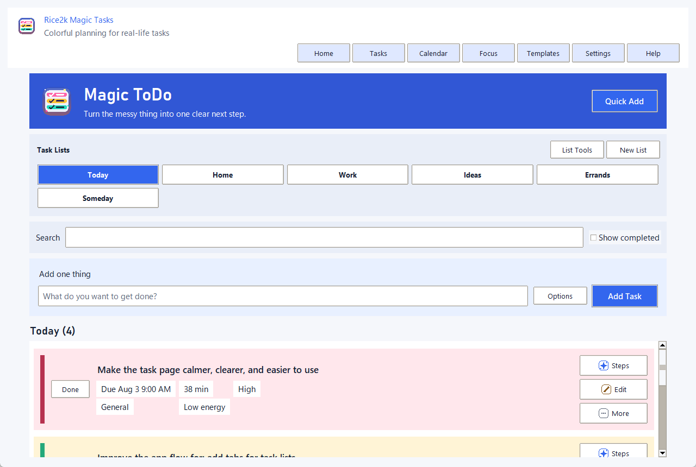
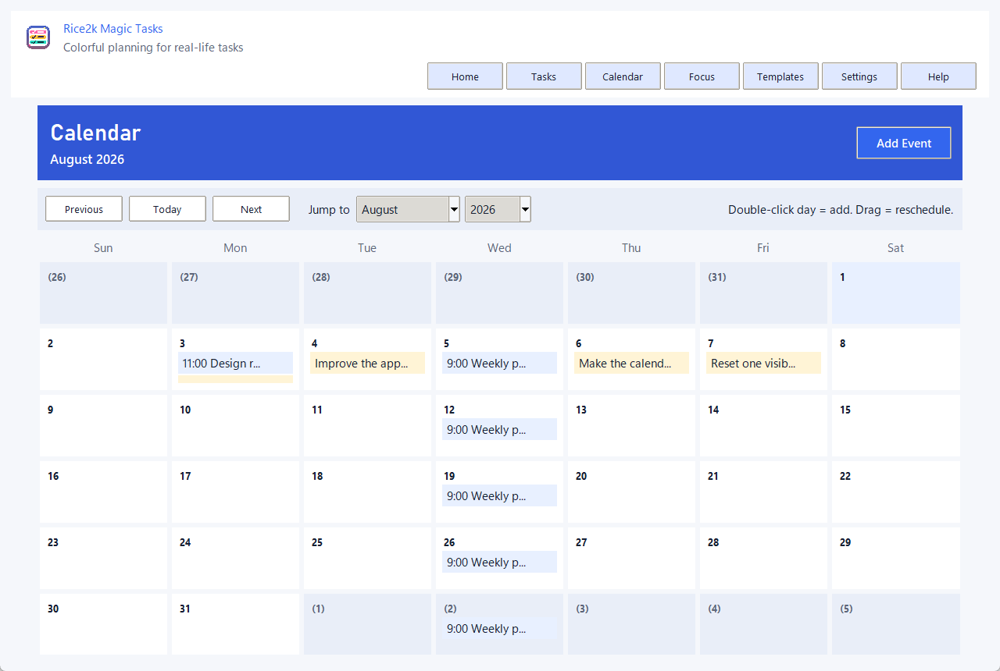
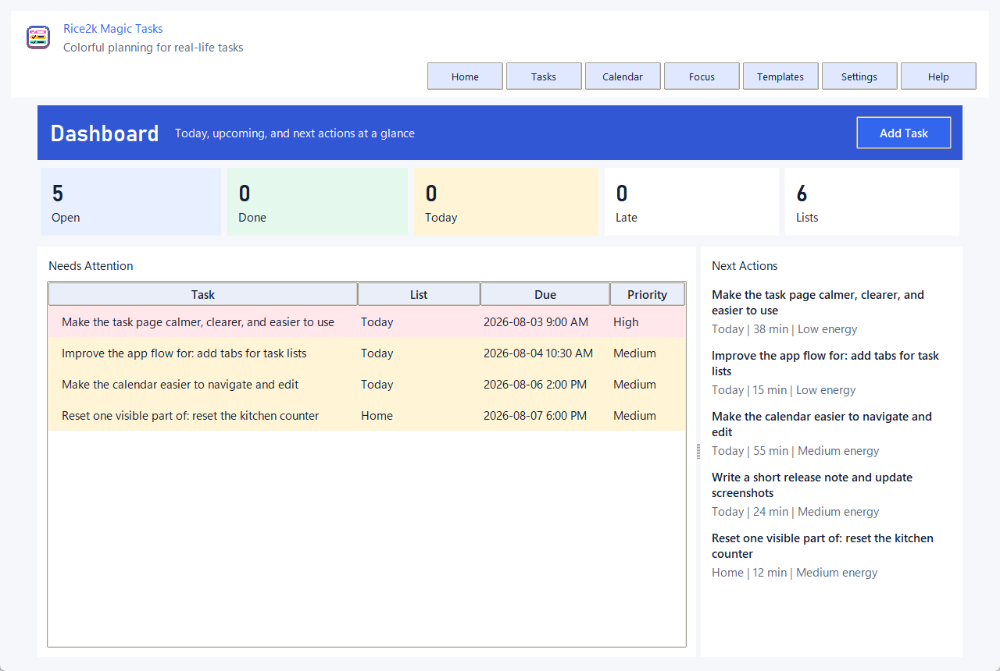
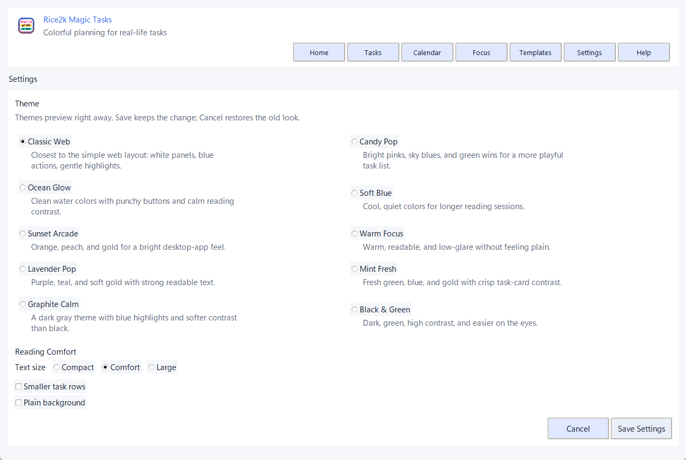
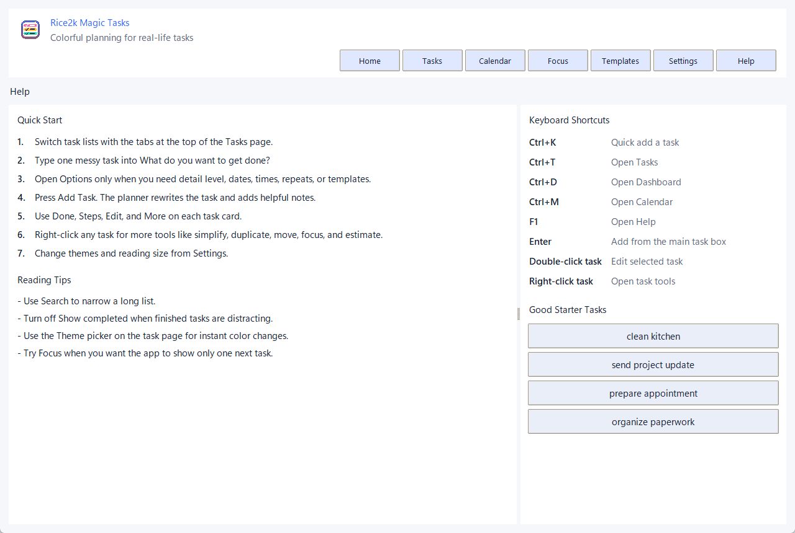

# Rice2k Magic Tasks

<p align="center">
  
</p>

<p align="center">
  A colorful Windows task planner that turns messy to-dos into smaller, calmer next actions.
</p>

<p align="center">
  
  
  
  
</p>

## Screenshots











## Download

Get the latest Windows build from the [Releases](../../releases) page.

The v3.2.0 release includes:

- `Rice2k-Magic-Tasks-v3.2.0.exe` - single-file Windows app.
- `Rice2k-Magic-Tasks-v3.2.0.zip` - release package.
- `Rice2k-Magic-Tasks-v3.2.0.sha256` - checksum file.
- `Rice2k-Magic-Tasks-Source-v3.2.0.zip` - source archive.

Windows may show a SmartScreen warning because the app is unsigned.

## What It Does

- Rewrites vague tasks into clearer action wording.
- Breaks large tasks into smaller steps.
- Adds estimates, priority hints, categories, and energy levels.
- Saves helpful notes with a start step, small win, finish line, first check, stuck option, and useful question.
- Keeps your task data local on your computer.
- Supports due dates, reminders, recurring tasks, templates, a dashboard, calendar view, focus mode, and tray access.

## How To Use

1. Open `Rice2k-Magic-Tasks-v3.2.0.exe`.
2. Pick a task-list tab at the top of the Tasks page.
3. Type a task into **What do you want to get done?**.
4. Open **Options** only when you want detail level, due date, time, repeat, or templates.
5. Press **Add Task**.
6. Use the task buttons:
   - **Steps** breaks the task into subtasks.
   - **Edit** changes the task text, notes, due date, reminders, and recurrence.
   - **More** opens the full task menu with scheduling, subtasks, copy, focus, and delete tools.
7. Right-click a task for the same full menu.
8. Use **Calendar** to add events, edit events, duplicate events, set recurrence, and create tasks from events.
9. Use the calendar month and year pickers to jump quickly.
10. Drag tasks or events to another calendar day to reschedule them.
11. Use **Search** or **Show completed** when the list gets long.
12. Change themes and reading size from **Settings**.
13. Press **F1** for the built-in help page.

## Shortcuts

- `Ctrl+K` - quick add a task.
- `Ctrl+T` - open Tasks.
- `Ctrl+D` - open Dashboard.
- `Ctrl+M` - open Calendar.
- `F1` - open Help.
- Double-click a task to edit it.
- Right-click a task to open task tools.

## Themes

Rice2k Magic Tasks now includes ten themes:

- Classic Web
- Candy Pop
- Ocean Glow
- Soft Blue
- Sunset Arcade
- Warm Focus
- Lavender Pop
- Mint Fresh
- Graphite Calm
- Black & Green

Settings also includes smaller task rows and a plain background option for reading comfort.

## Features

### Smart Planning

- Local planner for task rewriting, breakdowns, estimates, categories, energy levels, and priorities.
- Better planning for app, website, UI, file, and theme tasks.
- Cleaner guidance for vague tasks with **Start here**, **Small win**, **Check first**, **If stuck**, and **Helpful question** notes.
- More useful subtasks for home, work, health, errands, admin, school, creative, and email tasks.

### Task Management

- Multiple named task lists with quick tabs instead of a dropdown.
- Nested subtasks.
- Large clickable task cards.
- Cleaner task page with fewer always-visible buttons and optional add-task controls.
- Colorful task cards with readable due date, estimate, priority, category, and energy badges.
- Multi-font UI pairing with display, body, compact badge, and mono fallbacks.
- Responsive title wrapping and shorter labels to keep text inside task cards and calendar cells.
- Text-size control with Compact, Comfort, and Large modes.
- Long-word protection for pasted links or unbroken text in task cards and reminders.
- Colored priority stripes.
- Search and completed-task filtering, with completed tasks hidden by default to reduce clutter.
- Checkbox controls.
- Labeled icon buttons.
- Compact **List Tools** menu for list management, templates, export, import, estimate, prioritize, and cleanup actions.
- Right-click task menu.
- Right-click submenus for scheduling, recurrence, priority, category, notes, copying, and calendar conversion.
- Built-in Help page with quick-start steps and shortcuts.
- Manual editing with notes, due date, due time, reminder timing, and recurrence.
- Move tasks up or down inside a list.

### Scheduling

- Due dates and due times.
- In-app reminders while the app is running.
- Daily, weekday, weekly, and monthly recurring tasks.
- Automatic creation of the next recurring task after completion.
- Monthly calendar with tasks and events.
- Cleaner calendar grid with equal week rows and shorter readable event labels.
- Month and year pickers for faster calendar navigation.
- Add, edit, duplicate, delete, and repeat calendar events.
- Drag tasks and events between calendar days to reschedule.
- Event reminders while the app is running.
- Calendar right-click menus for day and item actions.

### Focus

- One-task focus mode.
- 5, 15, and 25 minute timers.
- One-click complete and next-task controls.
- Distraction capture box.

### Templates

- Built-in templates for morning reset, weekly planning, appointments, home cleanup, and work kickoff.
- Save your current list as a reusable template.
- Apply a template into a new list.

### Windows Tray

The packaged release includes tray support with quick access to:

- Open
- Focus Mode
- Exit

Closing the window hides the app to the tray when tray support is available.

## Run From Source

Requirements:

- Windows 10 or Windows 11
- Python 3.11 or newer

```powershell
python -m pip install -r requirements.txt
python src\rice2k_magic_tasks.py
```

You can also double-click `run_app.bat`.

## Build The EXE

```powershell
python -m pip install -r requirements.txt
python -m PyInstaller --noconfirm --clean --onefile --windowed --name Rice2kMagicTasks --icon assets\rice2k_magic_tasks.ico --add-data "assets;assets" src\rice2k_magic_tasks.py
```

The executable will be created at:

```text
dist\Rice2kMagicTasks.exe
```

Or run:

```powershell
build_exe.bat
```

## Data Storage

Tasks and settings are stored locally at:

```text
%APPDATA%\Rice2kMagicTasks\tasks.json
```

No account is required. The app does not upload task data by default.

## Verify Downloads

After downloading the EXE or ZIP, compare its SHA-256 hash with the release checksum file.

```powershell
Get-FileHash .\Rice2k-Magic-Tasks-v3.2.0.exe -Algorithm SHA256
```

## Project Layout

```text
src/
  rice2k_magic_tasks.py
assets/
  rice2k_magic_tasks.ico
  rice2k_magic_tasks.png
  actions/
docs/
  RELEASE_NOTES.md
  screenshots/
tests/
  smoke_test.py
build_exe.bat
run_app.bat
requirements.txt
```

## License

MIT License. See [LICENSE](LICENSE).
